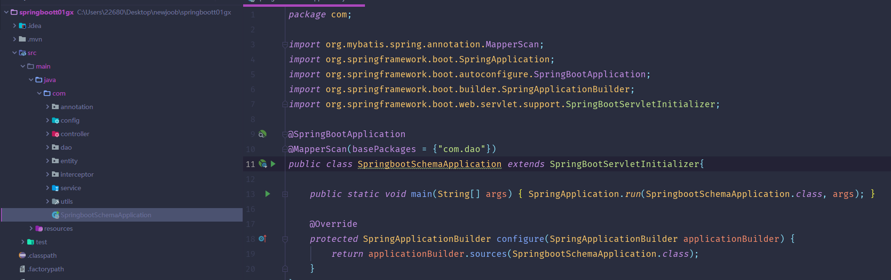
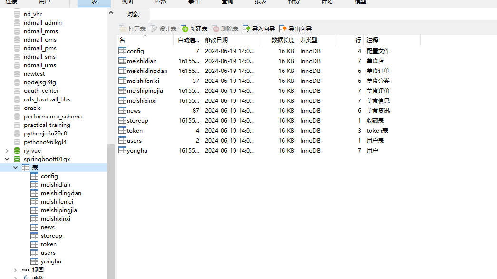
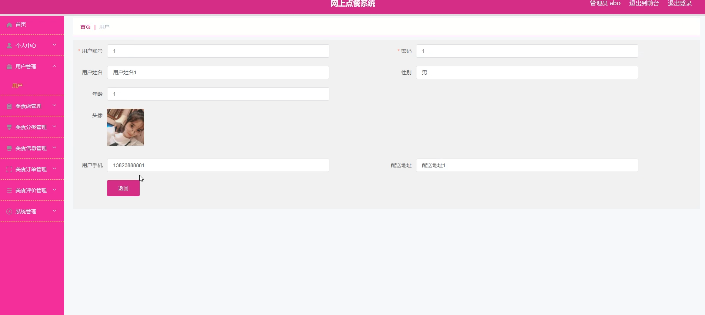
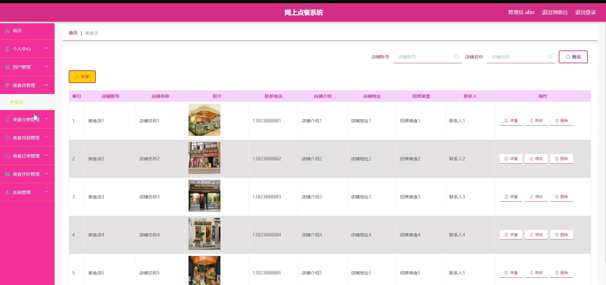
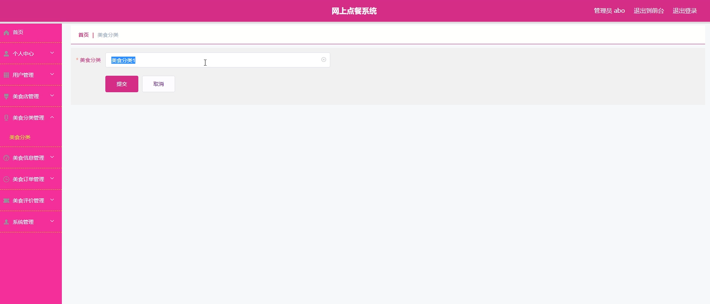
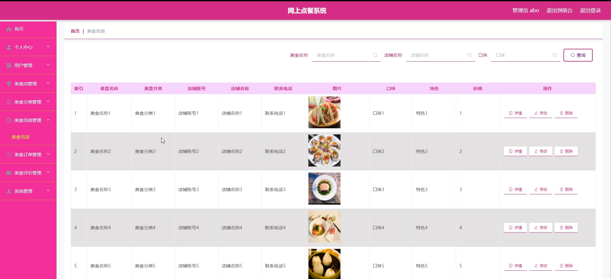
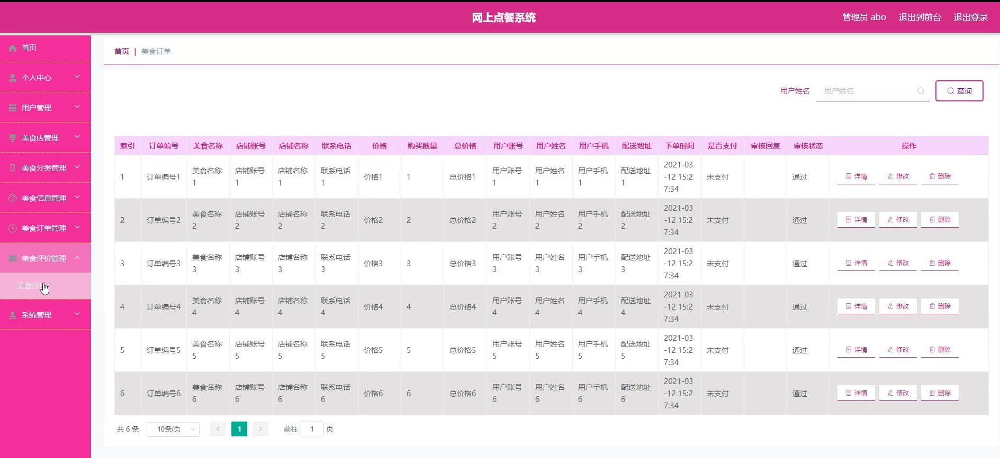
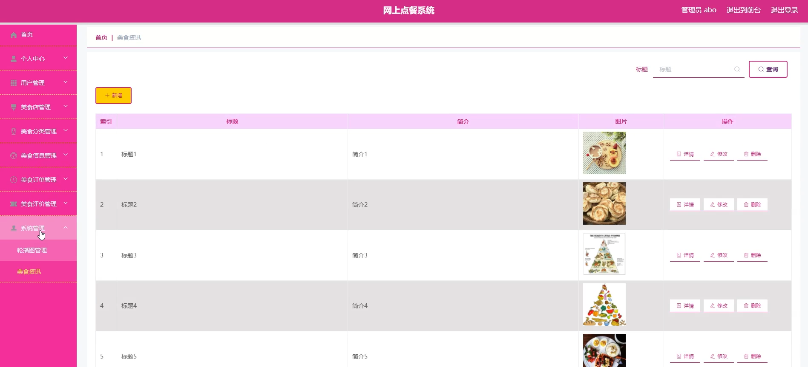
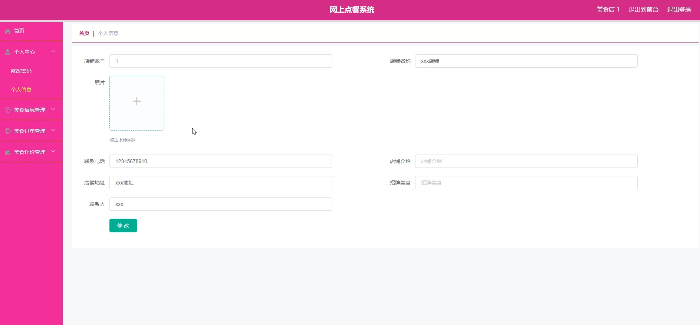
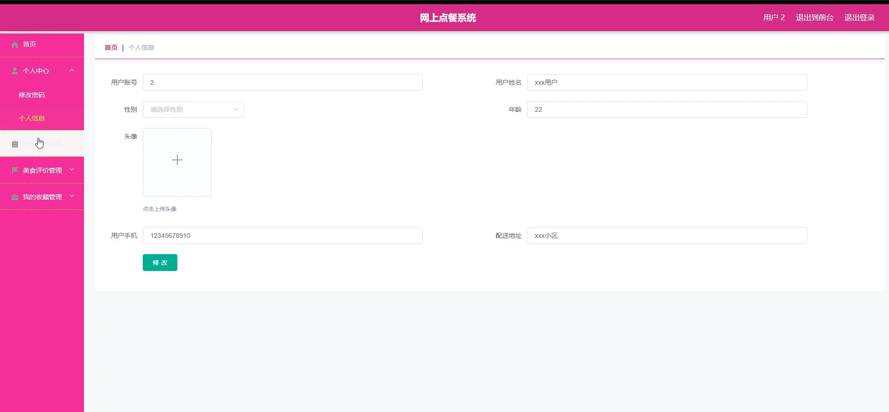

# 基于SSM的网上点餐系统

<h4 style='color:red'>联系不到我，就看我的主页 </h4> 
 
#### 介绍

在当今数字化时代，随着人们对便捷、高效服务的需求不断增长，我们推出了这款全新的网上点餐系统。该系统充分整合了互联网技术，旨在为广大美食爱好者、美食店家以及系统管理员提供一个一站式的服务平台。

本系统精心设计了三种角色：管理端、美食店端和用户端，以满足不同用户的需求，并确保系统的流畅运行与高效管理。

#### 技术栈介绍

后端技术栈：Springboot+Mysql+Maven

前端技术栈：Vue+Html+Css+Javascript+ElementUI

开发工具：Idea+Vscode+Navicate

#### 系统功能介绍

管理端功能模块

个人中心：管理员可以在个人中心查看和编辑个人信息，包括修改密码和更新联系方式，确保个人信息的准确性。

用户管理：管理员可以管理用户信息，包括新增、修改和删除用户，确保用户信息的准确和及时更新。

美食店管理：管理所有注册的美食店信息，包括审核、更新和删除美食店资料。

美食分类管理：管理美食的分类信息，新增、修改和删除美食分类，以便用户更方便地查找和点餐。

美食信息管理：管理美食店上传的美食信息，包括新增、修改和删除美食，确保菜单的更新和准确。

美食订单管理：查看和管理所有订单信息，包括订单状态跟踪、修改和删除订单。

美食评价管理：管理用户对美食和美食店的评价，确保评价的真实性和有效性。

系统管理：进行系统设置和维护，包括数据备份、权限管理和系统日志查看。

美食店端功能模块

个人中心：美食店可以在个人中心查看和编辑个人信息，包括修改密码和更新联系方式。

美食信息管理：管理本店的美食信息，包括新增、修改和删除美食，确保菜单的更新和准确。

美食订单管理：查看和管理所有订单信息，包括订单状态跟踪和订单处理。

美食评价管理：查看用户对本店美食的评价，进行回复和管理。

用户端功能模块

美食店：浏览和查看美食店信息，选择心仪的美食店进行点餐。

美食信息：浏览和查看美食信息，进行点餐操作。

美食评价：查看和发布对美食的评价，分享用餐体验。

美食资讯：获取最新的美食资讯和活动信息。

个人中心：用户可以在个人中心查看和编辑个人信息，包括修改密码和更新联系方式。

后台管理

美食订单管理：查看和管理自己的订单信息，包括订单状态跟踪和历史订单查看。

美食评价管理：管理自己发布的评价，查看其他用户的评价。

我的收藏管理：管理收藏的美食和美食店，方便快速查找和点餐。

#### 系统作用

对管理员的作用

高效管理：提供完善的管理工具，帮助管理员高效地管理用户、美食店和美食信息，确保系统的高效运行。

信息控制：管理员可以实时更新和控制美食分类和信息，确保用户能够获取最新的点餐信息。

评价监控：通过评价管理模块，管理员可以监控和管理用户的评价，确保平台评价的真实性和客观性。

对美食店的作用

订单处理：美食店可以高效地处理和管理订单信息，提高订单处理的效率和准确性。

信息更新：美食店可以实时更新美食信息，确保用户能够看到最新的菜单和美食信息。

用户互动：通过评价管理模块，美食店可以与用户互动，了解用户的反馈和建议，提升服务质量。

对用户的作用

便捷点餐：用户可以通过系统方便地浏览美食信息和进行点餐，提高点餐的便捷性和效率。

订单管理：用户可以实时查看和管理自己的订单信息，跟踪订单状态，确保点餐体验的顺畅。

评价分享：用户可以对美食和美食店进行评价，分享用餐体验，帮助其他用户做出选择。

#### 系统功能截图

代码结构

数据库表

登录

用户管理

美食店管理

美食分类

美食信息管理

美食订单管理

系统管理

美食店端个人信息

用户端首页

用户端后台管理

#### 总结

基于SpringBoot的网上点餐系统通过角色分工和功能模块的设计，实现了点餐、订单管理和评价的高效管理。管理员可以通过系统进行用户、美食店和美食信息的全面管理；美食店可以高效处理订单和管理美食信息；用户则可以方便地进行点餐、管理订单并分享用餐体验。该系统不仅提升了点餐的便捷性和效率，也为美食店的管理和用户的互动提供了强有力的支持。

#### 使用说明

创建数据库，执行数据库脚本 修改jdbc数据库连接参数 下载安装maven依赖jar 启动idea中的springboot项目

后台地址：http://localhost:8080/springboott01gx/admin/dist/index.html

管理员  abo 密码 abo

前台地址：http://localhost:8080/springboott01gx/front/index.html

